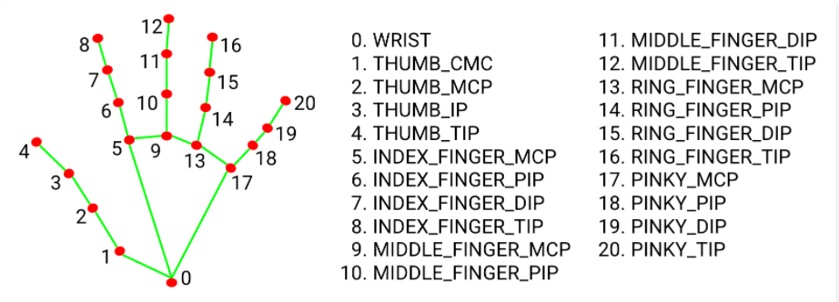
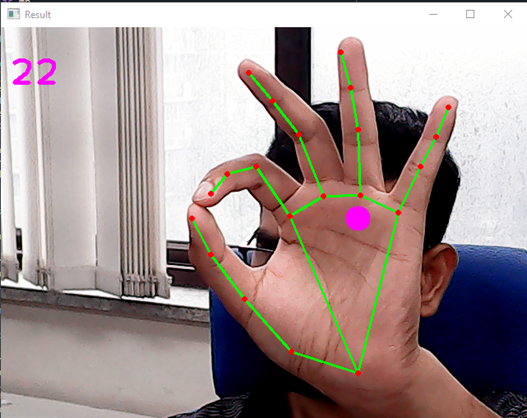

# Gesture Mouse Control 🖱️✋

Control your computer mouse using just your hand movements and gestures – powered by **OpenCV**, **Mediapipe**, and **cvzone**.


---

## 🚀 Features
- Move your mouse cursor with your index finger  
- Click by pinching your thumb and index finger together  
- Works with just a webcam, no extra hardware needed  

---

## 📦 Installation

### 1. Clone the Repository
```bash
git clone https://github.com/YourUsername/gesture-mouse.git
cd gesture-mouse
```

### 2. Create a Virtual Environment (optional but recommended)
```bash
python -m venv venv
source venv/bin/activate   # Linux / Mac
venv\Scripts\activate      # Windows
```

### 3. Install Dependencies
```bash
pip install opencv-python mediapipe cvzone pyautogui
```

### ▶️ Run the App
```bash
python main.py
```
Move your index finger → cursor moves

Pinch index finger + thumb → click

Release fingers → mouse up




## 📋 Requirements

Python 3.7+

Webcam

Windows/Linux/Mac

## 🙌 Credits

Mediapipe
 for hand tracking

cvzone
 by @murtazasworkshop

pyautogui
 for mouse control


